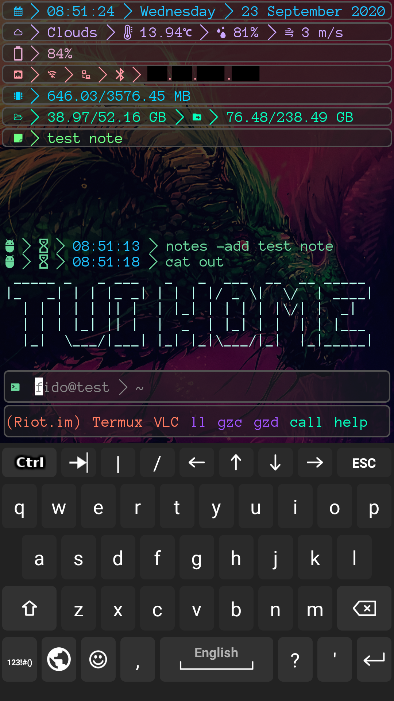

# T-UI configuration

## A bit of info
T-UI is an unique and surprisingly usable android launcher that emulates the looks (and some functionality) of various unix shells, coming with many integrations to android (like calling, messaging, viewing notifications, playing music, launching apps, etc) fuzzy search, autosuggestions, fallback to plain android's sh and much more.  

This is my T-UI configuration. It's not complete, neither
I plan to complete it.

## Requirements
- T-UI version 6.15.205+ (I use F-Droid's one)

## Installation
- Clone this repo to the root of your phone's internal storage (/storage/emulated/0 or /sdcard)
- Adjust weather location as shown [here](https://github.com/fAndreuzzi/TUI-ConsoleLauncher/wiki/Weather#couldnt-get-your-location)
- (Optionally) change your OpenWeatherMap API key (the default one is provided by the T-UI developer)
- Customize the launcher further with [this documentation](https://github.com/fAndreuzzi/TUI-ConsoleLauncher/wiki)

## License
- [Nerd Fonts patched Anonymous Pro Font](https://github.com/ryanoasis/nerd-fonts): MIT 
- Everything else: WTFPL
